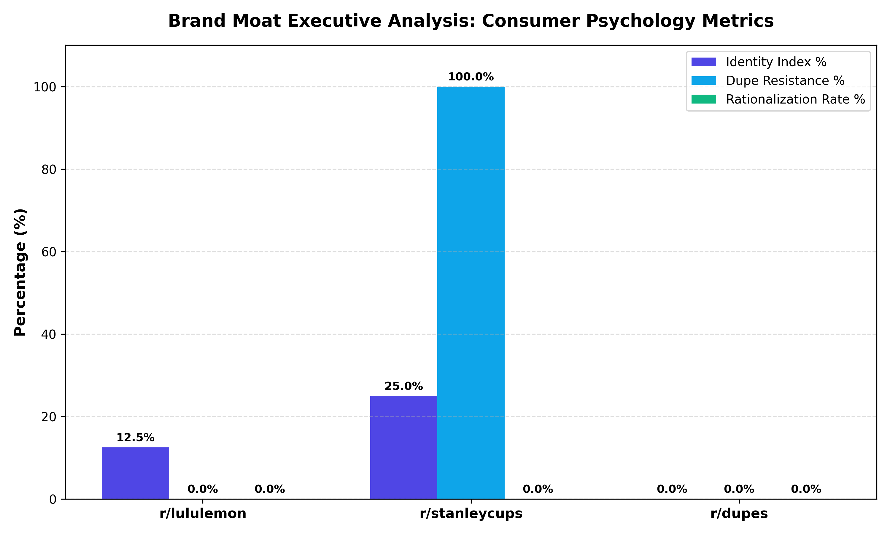

Brand Moat Intelligence Engine
A Scalable, Modular Analytics Pipeline for Consumer Psychology & Brand Equity
Executive Summary

Traditional social listening tools rely heavily on basic sentiment analysis (positive vs. negative valence), which fails to capture why consumers buy premium products or how resistant a brand is to lower-cost alternatives ("dupes").

The Brand Moat Intelligence Engine is a lightweight, brand-agnostic data pipeline engineered to quantify underlying consumer psychology across online communities. By processing unstructured community commentary through an LLM classification framework, the system extracts structural brand moat indicators:

Identity vs. Utility Driver: Measures whether consumers purchase for social status/community belonging or raw functional performance.

Dupe Resistance Rate: Measures the proportion of consumers actively rejecting knockoffs/alternatives in favor of the authentic brand.

Investment Rationalization Rate: Tracks price-per-wear and durability logic used by consumers to justify premium price points.